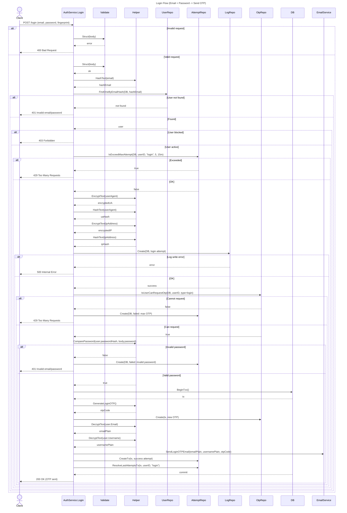

```mermaid
    sequenceDiagram
    title Login Flow (Email + Password -> Send OTP)
    actor Client
    participant Auth as AuthService.Login
    participant Validate
    participant Helper
    participant UserRepo
    participant AttemptRepo
    participant LogRepo
    participant OtpRepo
    participant DB
    participant Mail as EmailService
    
    Client ->> Auth: POST /login (email, password, fingerprint)

    alt Invalid request
        Auth ->> Validate: Struct(body)
        Validate -->> Auth: error
        Auth -->> Client: 400 Bad Request
    else Valid request
        Auth ->> Validate: Struct(body)
        Validate -->> Auth: ok
        Auth ->> Helper: HashText(email)
        Helper -->> Auth: hashEmail
        Auth ->> UserRepo: FindOneByEmailHash(DB, hashEmail)
        alt User not found
            UserRepo -->> Auth: not found
            Auth -->> Client: 401 Invalid email/password
        else Found
            UserRepo -->> Auth: user
            alt User blocked
                Auth -->> Client: 403 Forbidden
            else User active
                Auth ->> AttemptRepo: IsExceedMaxAttempt(DB, userID, "login", 5, 15m)
                alt Exceeded
                    AttemptRepo -->> Auth: true
                    Auth -->> Client: 429 Too Many Requests
                else OK
                    AttemptRepo -->> Auth: false
                    Auth ->> Helper: EncryptText(userAgent)
                    Helper -->> Auth: encryptedUA
                    Auth ->> Helper: HashText(userAgent)
                    Helper -->> Auth: uaHash
                    Auth ->> Helper: EncryptText(ipAddress)
                    Helper -->> Auth: encryptedIP
                    Auth ->> Helper: HashText(ipAddress)
                    Helper -->> Auth: ipHash
                    Auth ->> LogRepo: Create(DB, login attempt)
                    alt Log write error
                        LogRepo -->> Auth: error
                        Auth -->> Client: 500 Internal Error
                    else OK
                        LogRepo -->> Auth: success
                        Auth ->> OtpRepo: IsUserCanRequestOtp(DB, userID, type=login)
                        alt Cannot request
                            OtpRepo -->> Auth: false
                            Auth ->> AttemptRepo: Create(DB, failed: max OTP)
                            Auth -->> Client: 429 Too Many Requests
                        else Can request
                            OtpRepo -->> Auth: true
                            Auth ->> Helper: ComparePassword(user.passwordHash, body.password)
                            alt Invalid password
                                Helper -->> Auth: false
                                Auth ->> AttemptRepo: Create(DB, failed: invalid password)
                                Auth -->> Client: 401 Invalid email/password
                            else Valid password
                                Helper -->> Auth: true
                                Auth ->> DB: BeginTxx()
                                DB -->> Auth: tx
                                Auth ->> Helper: GenerateLoginOTP()
                                Helper -->> Auth: otpCode
                                Auth ->> OtpRepo: Create(tx, new OTP)
                                Auth ->> Helper: DecryptText(user.Email)
                                Helper -->> Auth: emailPlain
                                Auth ->> Helper: DecryptText(user.Username)
                                Helper -->> Auth: usernamePlain
                                Auth ->> Mail: SendLoginOTPEmail(emailPlain, usernamePlain, otpCode)
                                Auth ->> AttemptRepo: CreateTx(tx, success attempt)
                                Auth ->> AttemptRepo: ResolveLastAttemptsTx(tx, userID, "login")
                                DB -->> Auth: commit
                                Auth -->> Client: 200 OK (OTP sent)
                            end
                        end
                    end
                end
            end
        end
    end
```